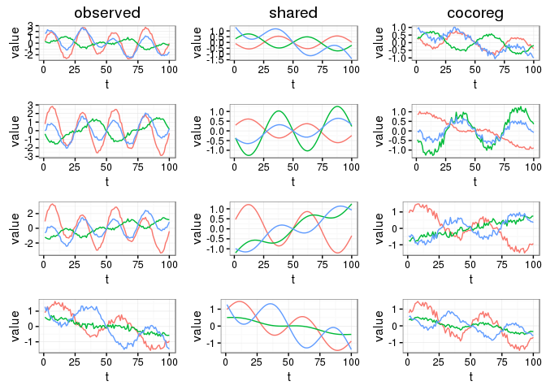
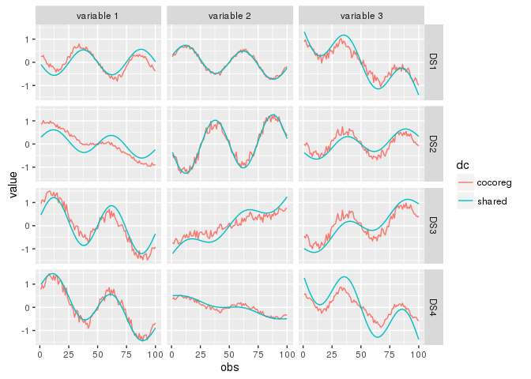

<!-- README.md is generated from README.Rmd. Please edit that file -->
cocoreg
=======

`cocoreg` is an [R-package](https://www.r-project.org/) for extracting shared variation in collections of datasets using regression models.

A minimal usage example:

``` r
library(cocoreg)
dc <- create_syn_data_toy()
ccr <- cocoreg(dc$data)
shared.by.all.df <- variation_shared_by(dc, 'all') #only on synthetic datasets
ggplot_dclst(list(observed = dc$data, shared = shared.by.all.df, cocoreg = ccr$data))
```

 

``` r

library(reshape) #importing from namespace does not work as expected
ggcompare_dclst(list(shared = shared.by.all.df, cocoreg = ccr$data))
```

 

Overview
--------

The most important functions in cocoreg are:

-   `cocoreg()` which extracts shared variation from a collection of datasets

-   Functions to visualize output such as `ggplot_dclst()` and `ggcompare_dclst()` for lists of data collections, `ggplot_dflst()` for lists of data.frames (i.e. one data collection) and `ggplot_df()` for a single data.frame (a dataset)

Installation
------------

Install the release version from CRAN:

``` r
install.packages("cocoreg")
```

Or the development version from GitHub:

``` r
# install.packages("devtools")
# library(devtools)
devtools::install_github("bwrc/cocoreg-r")
```
